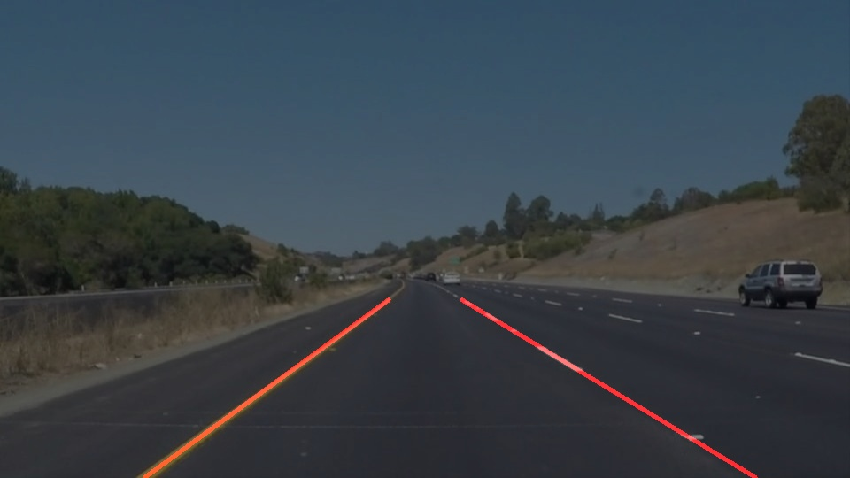

# **Finding Lane Lines on the Road** 
Thomas Smith

This project, completed as part of the Udacity Self Driving Car Engineer NanoDegree, detects lane lines in images using Python and OpenCV.

The project submission files are:
 - [Jupyter Notebook](P1.ipynb)
 - [Write Up](writeup.md)
 
There are also two parameterisation tools: [color_detection.py](color_detection.py) and [lanefind_gui.py](lanefind_gui.py). These are called from the command line with the image (\*.jpg) or video (\*.mp4) file to open as an argument, for example 
`python color_detection.py test_images/solidWhiteRight.jpg`

The conda environment is exported as environment.yml. Note this differs slightly from the Udacity provided environment during version conflicts identified during environment set up.
